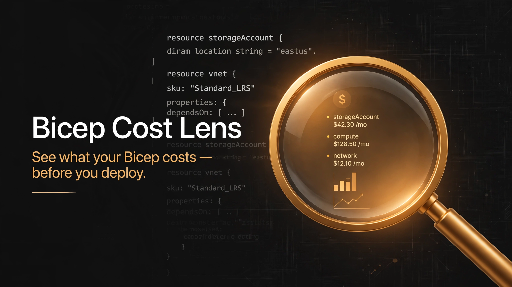
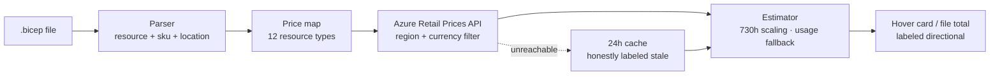

[](https://github.com/gritfytechnologies/bicep-cost-lens/actions/workflows/ci.yml)
[](LICENSE)
[](CHANGELOG.md)

# Bicep Cost Lens

**See what your Bicep costs — before you deploy.**

> Free. No account. No backend. No telemetry.

---

## ✨ What you get

| | |
|---|---|
| 🔍 **Hover any Bicep resource** | Instant directional monthly cost range, pulled live from the [Azure Retail Prices API](https://learn.microsoft.com/en-us/rest/api/cost-management/retail-prices/azure-retail-prices) for your region and currency. |
| 🧾 **`Cost Lens: Estimate File Cost`** | Totals the directional cost of every priced resource in the open `.bicep` file, straight into the Output panel. |
| 📣 **FinOps audit CTA** | A status-bar nudge — *"Get a full FinOps audit"* — for when the estimate says "you should probably look at this properly." |

### What the hover actually looks like

Hovering `resource vm 'Microsoft.Compute/virtualMachines@2024-07-01'` shows:

> ### 💰 Bicep Cost Lens
>
> **vm** (`Microsoft.Compute/virtualMachines`)
>
> Estimated monthly cost: **$73.00 – $81.50 CAD**
>
> *730-hour month · 4 price record(s)*
>
> > Directional estimate — list prices only, no EA/MCA discounts, reservations, or hybrid benefit. Verify with the Azure Pricing Calculator before budgeting.

---

## ⚙️ How it works



1. **Parse** — reads `resource` declarations (type, API version, SKU, VM size, location) out of your `.bicep` files. No language server required.
2. **Map** — matches each resource type to its Azure Retail Prices `serviceName` (12 resource types covered and growing).
3. **Price** — queries Microsoft's public price list filtered to your region and currency, cached for 24 hours.
4. **Estimate** — scales hourly meters to a 730-hour month; usage-based meters (per-GB, per-transaction) are shown per-unit because they can't be scaled without your usage data.
5. **Label** — every number is marked **directional**, with the caveats attached. No accuracy theater.

## 🛡️ The honest caveats (read these)

Every estimate is directional because it is:

- **List prices only** — no EA/MCA discounts, reservations, hybrid benefit, or spot pricing.
- **730-hour month** for hourly meters; usage-based meters shown per-unit.
- **Excludes** data transfer, support plans, and anything the Retail Prices API doesn't cover.

**Verify with the [Azure Pricing Calculator](https://azure.microsoft.com/en-us/pricing/calculator/)
before budgeting.** If an estimate ever looks wrong,
[open an issue](https://github.com/gritfytechnologies/bicep-cost-lens/issues).

## 🔧 Settings

| Setting | Default | Meaning |
|---|---|---|
| `bicepCostLens.region` | `canadacentral` | Azure region for price lookups (e.g. `eastus`, `westeurope`) |
| `bicepCostLens.currency` | `CAD` | ISO currency code (e.g. `CAD`, `USD`) |
| `bicepCostLens.auditUrl` | `https://gritfytechnologies.com` | Destination of the FinOps audit CTA |

## 📴 Offline behavior

Prices are cached for 24 hours. If Azure's price list is unreachable, the extension serves
the last-known prices labeled as cached — or tells you plainly it can't compute an estimate.
It never fails silently.

## 🧊 Why zero dependencies

This extension ships with **zero runtime dependencies** (bundled with esbuild). Fewer
dependencies = smaller attack surface, faster activation, and nothing to go stale or get
supply-chain hijacked. The only network call is to Microsoft's public Retail Prices API.

## 🧑‍💻 Development

```bash
npm install
npm run build      # bundle to dist/
npm run watch      # rebuild on change
npm run lint       # eslint (CI-enforced)
npm run typecheck  # tsc --noEmit
npm run test       # vitest with coverage (≥80% gate on pure logic)
npm run test:e2e   # headless VS Code run of every command
npm run package    # vsce package -> .vsix (no publish)
```

CI runs lint + typecheck + unit tests + packaging on every push, and headless e2e under xvfb.

## 🚀 Release process

Per [extension standards](../../standards/extension-standards.md): unit + e2e green →
manual QA checklist signed → pre-release soak 7 days → promote to release.
`CHANGELOG.md` is updated on every release.

## 📄 License

MIT — see [LICENSE](LICENSE).
