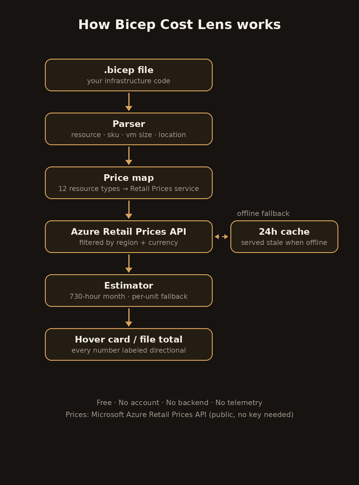

[](https://github.com/gritfytechnologies/bicep-cost-lens/actions/workflows/ci.yml)
[](LICENSE)
[](CHANGELOG.md)

# Bicep Cost Lens

**See what your Bicep costs — before you deploy.**

> Free. No account. No backend. No telemetry.

---

## 📦 Install

### VS Code extension

**From the Marketplace** (once published): open the Extensions view (`Ctrl+Shift+X` /
`Cmd+Shift+X`), search **"Bicep Cost Lens"**, click Install.

**From a `.vsix`** (right now): download the latest `.vsix` from
[GitHub Releases](https://github.com/gritfytechnologies/bicep-cost-lens/releases),
then either

```bash
code --install-extension bicep-cost-lens-0.1.0.vsix
```

or in VS Code: Extensions view → `···` menu → **Install from VSIX…** → pick the file.

**Requirements:** VS Code 1.85+, the
[Bicep extension](https://marketplace.visualstudio.com/items?itemName=ms-azuretools.vscode-bicep)
for language support (Cost Lens adds the cost layer on top).

### CLI (for pipelines — zero install)

The CLI is a single bundled JavaScript file with zero dependencies. No `npm install`,
no checkout of this repo — just Node 20+ and network access to `prices.azure.com`:

```bash
curl -sL https://raw.githubusercontent.com/gritfytechnologies/bicep-cost-lens/v0.1.0/dist/cli.js \
  -o cost-lens.js
node cost-lens.js --budget 500 --currency CAD infra/main.bicep
```

---

## 🖱️ Using it in VS Code

1. **Hover any Bicep resource.** Open a `.bicep` file, hover a `resource` line —
   a card shows the estimated monthly cost range for your region and currency:

   > ### 💰 Bicep Cost Lens
   >
   > **vm** (`Microsoft.Compute/virtualMachines`)
   >
   > Estimated monthly cost: **$73.00 – $81.50 CAD**
   >
   > *730-hour month · 4 price record(s)*
   >
   > > Directional estimate — list prices only, no EA/MCA discounts, reservations,
   > > or hybrid benefit. Verify with the Azure Pricing Calculator before budgeting.

2. **Estimate the whole file.** Command Palette (`Ctrl+Shift+P`) →
   **Cost Lens: Estimate File Cost** — totals every priced resource into the Output panel.

3. **Tune it.** Settings (`bicepCostLens.*`):

   | Setting | Default | Meaning |
   |---|---|---|
   | `bicepCostLens.region` | `canadacentral` | Azure region for price lookups |
   | `bicepCostLens.currency` | `CAD` | ISO currency code |
   | `bicepCostLens.auditUrl` | `https://gritfytechnologies.com` | Destination of the FinOps audit CTA |

4. **Working offline?** Prices are cached for 24 hours. If Azure's price list is
   unreachable you'll get last-known prices **labeled as cached** — or a plain-language
   message. Never a silent wrong number.

## 🖥️ Using the CLI

```bash
node cost-lens.js [options] <file.bicep>

  --budget <n>       Monthly budget in your currency. Exits 2 when the
                     estimate exceeds it — that's your pipeline gate.
  --currency <code>  ISO code, default CAD.
  --region <name>    Azure region, default canadacentral.
  --format <fmt>     markdown (default) or json.
```

Exit codes: **0** under budget · **1** usage/IO error · **2** over budget.

Example output:

```bash
$ node cost-lens.js --budget 500 --currency CAD infra/main.bicep

## 💰 Bicep Cost Lens — `infra/main.bicep`

| Resource | Type | Estimated monthly cost |
|---|---|---|
| `vm` | `Microsoft.Compute/virtualMachines` | **$73.00 – $81.50 CAD** |
| `storage` | `Microsoft.Storage/storageAccounts` | **$18.20 – $24.60 CAD** |

**Total (directional):** **$91.20 – $106.10 CAD**
**Budget:** $500.00 CAD → ✅ under budget
```

---

## 🚦 Cost gate in your pipeline

Wire the CLI into Azure DevOps or GitHub Actions so every Bicep change is checked
against the team's allocated budget **before** it deploys. Over budget → the build
fails (or routes to an approver) instead of the invoice surprising you.

### GitHub Actions — PR gate with estimate comment

```yaml
# .github/workflows/cost-gate.yml
name: Cost gate
on:
  pull_request:
    paths: ['infra/**/*.bicep']

jobs:
  estimate:
    runs-on: ubuntu-latest
    steps:
      - uses: actions/checkout@v4

      - name: Estimate Bicep cost vs budget
        id: cost
        run: |
          curl -sL https://raw.githubusercontent.com/gritfytechnologies/bicep-cost-lens/v0.1.0/dist/cli.js \
            -o /tmp/cost-lens.js
          node /tmp/cost-lens.js --budget 500 --currency CAD infra/main.bicep | tee estimate.md
          echo "exit_code=$?" >> "$GITHUB_OUTPUT"

      - name: Comment estimate on the PR
        uses: actions/github-script@v7
        with:
          script: |
            const fs = require('fs');
            await github.rest.issues.createComment({
              ...context.repo,
              issue_number: context.issue.number,
              body: fs.readFileSync('estimate.md', 'utf8'),
            });

      - name: Fail when over budget
        if: steps.cost.outputs.exit_code == '2'
        run: |
          echo "::error::Bicep estimate exceeds the $500 CAD budget — FinOps approval required."
          exit 1
```

### Azure DevOps — pre-deployment budget gate

```yaml
# azure-pipelines.yml
trigger:
  paths:
    include: ['infra/*.bicep']

variables:
  monthlyBudget: 500        # <-- the team's allocated budget, in CAD
  azureRegion: canadacentral

stages:
  - stage: CostGate
    displayName: 'Budget gate'
    jobs:
      - job: Estimate
        pool: { vmImage: 'ubuntu-latest' }
        steps:
          - task: NodeTool@0
            inputs: { versionSpec: '20.x' }
          - script: |
              curl -sL https://raw.githubusercontent.com/gritfytechnologies/bicep-cost-lens/v0.1.0/dist/cli.js \
                -o $(Agent.TempDirectory)/cost-lens.js
              node $(Agent.TempDirectory)/cost-lens.js \
                --budget $(monthlyBudget) --currency CAD --region $(azureRegion) \
                $(Build.SourcesDirectory)/infra/main.bicep
            displayName: 'Bicep Cost Lens — budget gate'

  - stage: Deploy
    dependsOn: CostGate
    condition: succeeded()     # over budget? this stage never runs
    jobs:
      - deployment: Production
        environment: 'prod'    # or route to a manual approval for over-budget
        strategy:
          runOnce:
            deploy:
              steps:
                - script: echo "Deploying — budget check passed."
```

**Softer variant:** instead of failing, publish the markdown as a pipeline artifact
or post it to Teams/Slack, and add a Manual Validation task only when the CLI
exits 2. Same signal, human in the loop.

---

## 🎬 Real-world scenarios

### 1. The Friday-afternoon VM

A developer adds a `Standard_D2s_v3` VM to `dev.bicep` at 4:55 p.m. Hover shows
**~$73–210 CAD/month** — more than the whole dev resource group. They switch to a
`Standard_B2s` for dev before committing. Cost avoided, zero meetings.

### 2. The PR that blew the budget

A PR adds an `S1` Azure SQL database to the shared `main.bicep`. The GitHub Actions
cost gate runs `cost-lens.js --budget 500`, the estimate comes back at **$640 CAD**,
CI fails, and the estimate lands as a PR comment. The team discusses it *in the PR*
— downgrade to `S0`, or raise the budget with eyes open — instead of discovering it
on the invoice.

### 3. The ADO release gate

The platform team sets `monthlyBudget: 2000` in `azure-pipelines.yml`. Every Bicep
change is estimated in the `CostGate` stage; the `Deploy` stage only runs on success.
When a change pushes the estimate to $2,340, deployment pauses and FinOps gets an
approval request with the exact numbers attached. Budget enforcement moves left —
from the invoice to the pipeline.

### 4. The FinOps Friday review

Run `Cost Lens: Estimate File Cost` across each module once a week. Totals drift up
over time as SKUs creep; the file total makes the drift visible in seconds, per
module, before it compounds.

---

## ⚙️ How it works



1. **Parse** — reads `resource` declarations (type, API version, SKU, VM size,
   location) out of your `.bicep` files. No language server required.
2. **Map** — matches each resource type to its Azure Retail Prices `serviceName`
   (12 resource types covered and growing).
3. **Price** — queries Microsoft's public price list filtered to your region and
   currency, cached for 24 hours.
4. **Estimate** — scales hourly meters to a 730-hour month; usage-based meters
   (per-GB, per-transaction) are shown per-unit because they can't be scaled
   without your usage data.
5. **Label** — every number is marked **directional**, with the caveats attached.
   No accuracy theater.

## 🛡️ The honest caveats (read these)

Every estimate is directional because it is:

- **List prices only** — no EA/MCA discounts, reservations, hybrid benefit, or spot pricing.
- **730-hour month** for hourly meters; usage-based meters shown per-unit.
- **Excludes** data transfer, support plans, and anything the Retail Prices API doesn't cover.

**Verify with the [Azure Pricing Calculator](https://azure.microsoft.com/en-us/pricing/calculator/)
before budgeting.** If an estimate ever looks wrong,
[open an issue](https://github.com/gritfytechnologies/bicep-cost-lens/issues).

## 🧊 Why zero dependencies

This extension ships with **zero runtime dependencies** (bundled with esbuild). Fewer
dependencies = smaller attack surface, faster activation, and nothing to go stale or get
supply-chain hijacked. The only network call is to Microsoft's public Retail Prices API —
which needs no API key.

## 🧑‍💻 Development

```bash
npm install
npm run build      # dist/extension.js + dist/cli.js
npm run watch      # rebuild on change
npm run lint       # eslint (CI-enforced)
npm run typecheck  # tsc --noEmit
npm run test       # vitest with coverage (≥80% gate on pure logic)
npm run test:e2e   # headless VS Code run of every command
npm run package    # vsce package -> .vsix (no publish)
```

CI runs lint + typecheck + unit tests + packaging on every push, and headless e2e under xvfb.

## 🚀 Release process

Per the Gritfy extension standards: unit + e2e green →
manual QA checklist signed → pre-release soak 7 days → promote to release.
`CHANGELOG.md` is updated on every release.

## 📄 License

MIT — see [LICENSE](LICENSE).
